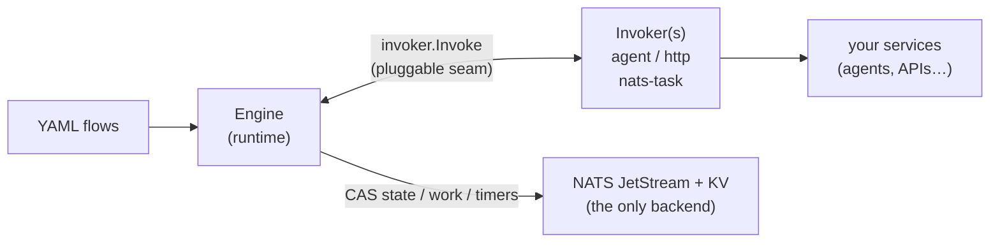

# Packtrail

A **durable, ecosystem-agnostic workflow engine** in Go, backed **only by NATS**
(Core + JetStream + KV + Message Scheduler). Packtrail orchestrates declarative YAML
flow graphs — `task`, `fanout`, `fanin`, `choice` and `signal` nodes — with
crash-durable state, retries, conditional routing, external signals and
timers/cron.

Packtrail's defining feature is that **node execution is pluggable**. The engine
never speaks a wire protocol directly: every `task`/branch node runs through an
[`Invoker`](invoker/invoker.go). A project plugs in its own transport — an
agent caller, an HTTP client, a NATS request/reply worker — and inherits all of
packtrail's durability machinery for free.



## Installation

```sh
go get github.com/henomis/packtrail
```

Requires Go 1.26+ and a running NATS server with JetStream enabled
(`nats-server -js`). Tests embed a real NATS server — no external server needed
to run them.

## Quick start

```go
nc, _ := nats.Connect(nats.DefaultURL)

srv, _ := packtrail.New(nc,
    packtrail.WithFlowsDir("flows"),          // directory of *.yaml flow files
    packtrail.WithNamespace("acme"),           // isolate from other deployments
    packtrail.WithInvoker("agent", myInvoker), // your transport
    packtrail.WithResultCache(),               // idempotent retries
)

// Register an in-process nats-task worker (optional)
srv.Handle("tasks.notify.*", notifyHandler)

id, _ := srv.Start(ctx, "agent-pipeline", payload)
srv.Signal(ctx, id, "approval", data)
ex, _ := srv.Get(ctx, id)

srv.Run(ctx) // blocks: engine + indexer + reconcile
```

## Built-in transport

Packtrail ships the built-in **`nats-task`** invoker — a `pkg/protocol`
request/reply on `tasks.<x>.*` — as the default transport. So:

- Any task worker that serves the protocol (`protocol.Serve` on `tasks.*`) works
  unchanged — just use the default `subject:` on a node.
- New flows can select any registered invoker per node via `invoker:` + `target:`.
- The core has **no dependency on any agent framework** (enforced by
  `internal/acceptance`), so it stays reusable by any project.

## Flow definition

```yaml
version: "1.0"
name: agent-pipeline
nodes:
  - {id: triage, type: task, invoker: agent, target: triage-agent,
     timeout: 2m, retry: {max_attempts: 3, backoff: exponential}}
  - id: route
    type: choice
    rules:
      - {when: 'payload.category == "billing"', to: billing-agent}
      - {default: true, to: general-agent}
  - {id: billing-agent, type: task, invoker: agent, target: billing-agent}
  - {id: general-agent, type: task, invoker: agent, target: general-agent}
  - {id: notify, type: task, subject: "tasks.notify.{execution_id}"}  # built-in nats-task
edges:
  - {from: triage, to: route}
  - {from: billing-agent, to: notify}
  - {from: general-agent, to: notify}
```

- `invoker:` selects a registered Invoker kind (default `nats-task`).
- `target:` is interpreted by that Invoker (an agent name, a URL, …); `subject:`
  is the nats-task alias. `{execution_id}` is substituted at dispatch.
- `retry.backoff` accepts `exponential`, `linear`, or `fixed` (default).

## Node types

### `task`

Invokes an Invoker with the current payload. The most common node type.

```yaml
- id: step
  type: task
  invoker: agent          # registered invoker kind (default: nats-task)
  target: my-agent        # interpreted by the invoker
  timeout: 2m
  retry:
    max_attempts: 3
    backoff: exponential
```

### `choice`

Routes the execution to one of several branches based on boolean expressions
evaluated against the shared payload:

```yaml
- id: route
  type: choice
  rules:
    - {when: 'payload.risk_score > 80', to: manual-review}
    - {when: 'payload.category == "billing" && payload.amount > 1000', to: billing-agent}
    - {default: true, to: general-agent}
```

- **Expression language.** `when` uses [expr-lang](https://expr-lang.org/): comparisons
  (`==`, `!=`, `<`, `>`), boolean logic (`&&`, `||`, `!`), membership (`in`),
  string and arithmetic operators. Compiled once on load — a syntax error is a
  validation error, not a runtime surprise.
- **`payload` variable.** The only variable in scope is `payload` (the shared
  execution payload). Reach into it with dotted paths: `payload.user.tier`,
  `payload.items[0].sku`.
- **First match wins.** Rules are evaluated top to bottom. Order from most to least
  specific.
- **`default` is required.** Validation rejects a choice node without a
  `{default: true, to: …}` branch, so a choice can never dead-end.
- **Missing fields fall through.** If a `when` expression errors (e.g. missing
  field), that rule counts as no match and evaluation continues to the next rule.

### `fanout` / `fanin`

Dispatch multiple branches in parallel and join them back:

```yaml
- id: fan
  type: fanout
  branches: [worker-a, worker-b, worker-c]

- id: join
  type: fanin
  wait_for: [worker-a, worker-b, worker-c]
  join_policy: all          # all | any | quorum:N
```

- `fanout` launches every branch listed in `branches` as a parallel sub-execution.
- `fanin` waits for the branches listed in `wait_for` according to `join_policy`:
  - `all` (default) — advance when every branch completes.
  - `any` — advance when the first branch completes.
  - `quorum:N` — advance when at least N branches complete.

### `signal`

Parks the execution until an external signal arrives (or the timeout fires):

```yaml
- id: wait-approval
  type: signal
  signal_name: approval
  timeout: 24h
  on_timeout: escalation    # node to jump to on timeout
```

Send the signal from your application:

```go
srv.Signal(ctx, execID, "approval", json.RawMessage(`{"approved": true}`))
```

The signal payload is merged into the execution payload and execution resumes at
the next node. If `timeout` elapses first, the execution advances to `on_timeout`
instead.

## Async activities (long-running work)

An Invoker normally returns a terminal status (`StatusOK`/`Error`/`Retry`) and
the engine settles the node synchronously. For long-running work (an agent call,
a remote job) an Invoker can instead return **`StatusPending`**: the engine parks
the execution as `waiting` and frees its work slot immediately, without blocking.

The worker that eventually finishes the activity calls
`Server.CompleteActivity(ctx, execID, node, attempt, result)` to settle it — OK
to advance, Error to fail, Retry to re-dispatch per the node policy. It is
idempotent and stale-safe (keyed by node + attempt, and robust to a completion
that arrives before the task has finished parking), so an at-least-once worker
can call it freely. This works for plain task nodes and fan-out branches alike.

```go
// dispatch (non-blocking): enqueue a durable job, return pending
func (d *dispatcher) Invoke(ctx context.Context, req packtrail.Request) (packtrail.Result, error) {
    enqueueJob(req.ExecutionID, req.NodeID, req.Attempt, req.Payload) // your durable queue
    return packtrail.Result{Status: packtrail.StatusPending}, nil
}

// later, from the worker that ran the job:
srv.CompleteActivity(ctx, execID, node, attempt,
    packtrail.Result{Status: packtrail.StatusOK, Payload: out})
```

## Resuming failed executions

A failed execution can be revived with `Resume`. It re-runs the node it failed
on with a fresh retry budget, preserving the durable payload. Any running engine
for the namespace picks up the resumed work.

```go
err := srv.Resume(ctx, execID)
```

## Cron scheduling

Start a flow on a recurring schedule with `ScheduleFlow`. The cron expression is
6-field (`sec min hour dom mon dow`):

```go
// trigger "daily-report" at 08:00 every day
srv.ScheduleFlow(ctx, "daily-report-schedule", "daily-report", "0 0 8 * * *", nil)
```

Calling `ScheduleFlow` again with the same name replaces the existing schedule.

To also run a periodic visibility reconciliation, configure it at startup:

```go
packtrail.WithReconcile("0 */5 * * * *") // reconcile every 5 minutes
```

## Writing an Invoker

An Invoker is the bridge between packtrail and your ecosystem:

```go
type Invoker interface {
    Invoke(ctx context.Context, req Request) (Result, error)
}
```

`Request` carries the resolved `Target`, the shared `Payload` (opaque JSON),
the `Attempt` number and a `Deadline`. Return `Result{Status: StatusOK, Payload:
out}` to advance with a new shared payload, `StatusError` to fail the node, or
`StatusRetry` (or a non-nil error) to retry per the node's policy.

### Idempotency under at-least-once delivery

Packtrail is durable because it may redeliver: if an engine crashes after invoking a
node but before persisting the advance, the work item is redelivered. Wrap
invocations in the result cache (`WithResultCache()`) so a redelivery of the
**same** `(execution, node, attempt)` returns the stored result instead of
re-running the side effect, while a genuine retry (a new attempt) still
re-invokes. Enable it whenever invocations have side effects that must not run
twice (LLM calls, writes, e-mails). See [`invoker/cache.go`](invoker/cache.go).

## Server options

| Option | Default | Description |
|--------|---------|-------------|
| `WithNamespace(prefix)` | `"packtrail"` | Prefix for every NATS resource; isolates deployments on a shared cluster |
| `WithFlowsDir(dir)` | — | Load all `*.yaml`/`*.yml` files in dir |
| `WithFlow(yamlDoc)` | — | Register a single flow from an inline YAML document; may be called multiple times |
| `WithInvoker(kind, inv)` | — | Register an Invoker under kind; overrides the built-in `"nats-task"` if reused |
| `WithResultCache()` | disabled | Cache invocation results by `(execution, node, attempt)` for idempotent retries |
| `WithReconcile(cronExpr)` | — | Schedule periodic visibility reconciliation (6-field cron) |
| `WithOwnerID(id)` | random | Stable per-instance lease owner id |
| `WithLeaseTTL(d)` | `30s` | Ownership lease TTL; a crashed instance's work becomes available after this |
| `WithMaxConcurrency(n)` | `64` | Max work items processed concurrently per instance |
| `WithDefaultTimeout(d)` | `30s` | Invocation timeout for nodes that omit one |

## Observability (packtrail-ui)

`cmd/packtrail-ui` is a read-only web dashboard for any packtrail deployment. It connects
to the same NATS cluster, reads execution state and the **flow registry** (every
flow's graph is published to a KV bucket at startup), and tails the live event
stream — so it needs no access to your flow source or engine process.

```sh
go run ./cmd/packtrail-ui --namespace packtrail --addr :8088   # NATS_URL honoured
```

It serves an embedded (no-npm) dashboard: a filterable execution list, a detail
view (status, current node, payload, branches, signals, error), and an **SVG flow
graph** with the live execution overlaid, updated in real time over SSE. The
backing API is also usable directly:

| endpoint | returns |
|----------|---------|
| `GET /api/flows` | flow names |
| `GET /api/flows/{name}` | flow graph (`FlowGraph`) |
| `GET /api/executions[?status=&flow=]` | execution summaries |
| `GET /api/executions/{id}` | full execution snapshot |
| `GET /api/events` | live transitions (Server-Sent Events) |

The same data is available programmatically via `Server`:

```go
// flows
names, _ := srv.ListFlows(ctx)
graph, _ := srv.FlowGraph(ctx, "agent-pipeline")

// executions
ids, _ := srv.ByStatus(ctx, packtrail.ExecRunning)
ids, _ := srv.ByFlow(ctx, "agent-pipeline")
ex, _ := srv.Get(ctx, execID)

// live event stream
events, _ := srv.WatchEvents(ctx)
for ev := range events {
    fmt.Println(ev.ExecID, ev.Status, ev.Node)
}
```

`WatchEvents` delivers events published after the call. Load current state via
`Get`/`ByStatus` first, then apply events live to avoid races.

## Development

```sh
go build ./...
go test -race ./...   # all packages run against a real embedded nats-server
go vet ./...
gofmt -l .
```

## License

Apache 2.0 — see [LICENSE](LICENSE).
